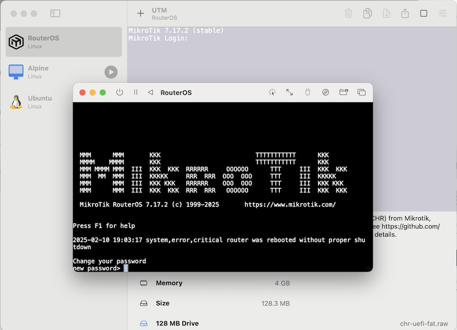

# RouterOS CHR for UTM 

### Ready-to-use [Mikrotik RouterOS](https://mikrotik.com/software) CHR for UTM*

If you have an Intel Mac, and UTM is already installed, you can install most release release here automatically.  __* Only Intel-based macOS with UTM installed is supported__, currently no support for Apple Silicon-based macOS.


> [!NOTE]
>
> #### To instal UTM virtual machine manager... download from either https://mac.getutm.app/ or [Mac App Store](https://apps.apple.com/us/app/utm-virtual-machines/id1538878817?mt=12).  Once UTM is installed, then use UTM app URL or download the `.zip` from Releases.



## Install 
### _Option One:_ Click "[Install RouterOS via URL](utm://downloadVM?url=https://github.com/tikoci/chr-utm/releases/latest/RouterOS.utm.zip)" to add CHR to UTM

> [!WARNING]
>
> _**Some browsers may not display the UTM installer link above.**_  Instead, cut-and-paste the UTM "app URL" below for the CHR installer into Safari on Intel macOS - this will launch UTM to add CHR virtual machine:
```
 utm://downloadVM?url=https://github.com/tikoci/chr-utm/releases/latest/RouterOS.utm.zip
```

### _Option Two:_  Download the [`RouterOS.utm.zip`](https://github.com/tikoci/chr-utm/releases/download/v7.17.2/RouterOS.utm.zip) from GitHub Releases, which expands into a runnable UTM virtual machine for CHR 


## Tips and Tricks

### Using Multiple CHRs on same macOS
The same image can install multiple times, using a couple of steps:
1. Change the MAC address inside the virtual machine settings for "RouterOS". Select "Network" on left, then "Random".  UTM will pick a new MAC address that won't config.  The issue all downloads will use the same MAC address - and thus same IP address – which is problematic.  UTM does not have the ability to automatically re-generate one (like VMWare/etc might do on VMX), but this step is critical.
2. By default, the CHR is named "RouterOS", since this also the "file" name.  You should rename any existing image from "RouterOS" to something like "CHR1" or whatever you like as long all CHR have a unique name in UTM.

### Networking Options
In UTM virtual machine settings for CHR, you have a few networking options. Two imporant things to know:
1. You can add more than one interface in UTM, but the is only one "Shared" network - which is a UTM-specific subnet, that is then NAT'ed out a "real" macOS interface.  And you should be able to use any many networks adapters with the "Shared" type, they still all be on the same subnet – may not be as useful for testing.
2. UTM also supports a "Bridged (advanced)" mode, and you can select either default first interface as that.  Or, add a new interface that uses Bridge mode, leaving the first for "Shared" as kinda management port.  With Bridge mode, CHR will act more like a router - in that at least it's own MAC address is on same LAN as macOS _as an independant_ device.
3. You can also add USB dongles or other network interface, and wire them up as a "Bridged (advanced)" Network interface in RouterOS UTM settings. This could, theoricially, connect CHR to some WAN or other network outside of macOS.
4. To isolate a UTM "Bridged" network from macOS usage, you can go to "Network" in System Preferences, and set IPv4 to "No" and set IPv6 to "Manual" on a UTM bridged interface to remove macOS for that bridged adapter.  

### No Display Support
The RouterOS image is configured to use UTM's serial terminal, by default.  This is for a couple reasons:
1. To ensure you always have access to a console - even if network config was bad.  2. In testing, UTM emulated Display – which would still just show text – is not comptible with CHR.  Since the Display still just show text, it's not that useful & very likely uses way more resources than serial window.

### Interesting Serial Port Options
Some tips:
1. You can use multiple serial ports, but you'll have to configure them via RouterOS to be used for something.
2. Default is a macOS window to show a ANSI terminal in window.  But UTM also support sending serial to a /dev/stty port.  This means you can use CLI tools like `screen` or `cu` to access the terminal.  To do this, change Serial (or add new serial port), to "Psuedo-TTY".  
3. Similarly a /dev/ssty  can be used to run `expect` scripts to do things like provisioning.

### RouterOS Console and `expect` Setup Automation
With a a "Psuedo-TTY" port, you can run classic UNIX® tools like `expect`, which a TCL-based automation of terminal.  Included in this project in an example script, [routeros-login.expect](routeros-login.expect) that will set a admin password & accept the license agreement.  To use it:
1. Download `routeros-login.expect` from [here](routeros-login.expect)
2. Install `expect`, on macOS with Homebrew it `brew install expect` - but script should work on non macOS platforms with expect installed.
3. Set RouterOS UTM virtual machine's serial port to use "Psuedo-TTY" within settings.  You will have to `/system/shutdown` to change settings.
4. After starting CHR, with Psuedo-TTY set, the main UTM screen will show a "Serial (TTY)", you'll need to copy the path shown.
5. Edit the download `routeros-login.expect` script, changing the "password" to be desired new "admin" password.  Do
6. You can run the script by using `expect -f <expect_file>`, or `chmod a+x <expect_file>` then just `./routeros-login.expect`.
7. Script should automatically accept the license agrement and bring you to a command prompt after inital install.
8. By default, routeros-login.expect using `screen` and the result of expect script to bring you an interactive prompt.  But to **exit `screen`** you need to use <kbd>Ctrl-A</kbd> (attention) followed by <kbd>Ctrl-D</kbd> (done) – _without the magic commands, it's not easy to leave the terminal._  
> **NOTE** The expect script is not fool-proof - more example of approach.  Also, while same script _can_ work for a "regular" login, it has to timeout waiting for the license agreemnt.  But feel free to use it as a basis for other automation.

### UTM Virtual Machine Automation

`expect` and other tool like `ssh` or `curl` may require a _running_.  UTM offers two solutions, described in their docs (https://docs.getutm.app/scripting/scripting/)
* *AppleScript*, which you can use macOS's Script Editor to run them.  Apple Shortcuts and Automator also supports running an AppleScript as a task.  To ensure VM is started, you can use this AppleScript to start it:
```applescript
tell application "UTM"
	set CHR to virtual machine named "RouterOS"
	if CHR's status is stopped then start CHR
end tell
```
> See Apple's [Automate tasks using AppleScript and Terminal on Mac](https://support.apple.com/lt-lt/guide/terminal/trml1003/mac) for command-line usage with `osascript`.  Also see [UTM's AppleScript documentation](https://docs.getutm.app/scripting/reference/)
* UTM's `utmctl` tool which is more limited that AppleScript, see [UTM docs](https://docs.getutm.app/scripting/scripting/#command-line-interface) for details on `utmctl`.


### "Free" CHR is limited to 1Mb/s
The image here has no license, so it runs in "free" mode.  The limits speed to  There is a "trial" mode that is also free, but you need to register at www.mikrotik.com to get a CHR trial license.  Mikrotik's [CHR documentation](https://help.mikrotik.com/docs/spaces/ROS/pages/18350234/Cloud+Hosted+Router+CHR#CloudHostedRouter%2CCHR-Freelicenses) describes fully but to summarize:

> **Free**
> The free license level allows CHR to run indefinitely. It is limited to 1Mbps upload per interface. All the rest of the features provided by CHR are available without restrictions.
>
> **60 Day Trial**
> In addition to the limited Free installation, you can also test the increased speed of P1/P10/PU licenses with a 60 trial.  You will have to have an account registered on MikroTik.com. Then you can request the desired license level for trial from your router that will assign your router ID to your account and enable the purchase of the license from your account. All the paid license equivalents are available for trial. A trial period is 60 days from the day of acquisition after this time passes, your license menu will start to show "Limited upgrades", which means that RouterOS can no longer be upgraded.
>
> **Paid Licenses**
> | License | Speed limit |Price |
> | --- | --- | --- |
> | Free	| 1Mbit	    | FREE |
> | P1	| 1Gbit	    | $45 |
> | P10	| 10Gbit	| $95 |
> | PU	| Unlimited	| $250 |


## About UTM and RouterOS
[UTM](https://mac.getutm.app/) is open source virtual machine host for Apple macOS, which avaialble for download, or via Mac App Store.  CHR is a Mikrotik RouterOS disk image for virtual machines, which is full operational, but bandwidth limited.  See [Mikrotik's CHR](https://help.mikrotik.com/docs/spaces/ROS/pages/18350234/Cloud+Hosted+Router+CHR#CloudHostedRouter,CHR-CHRLicensing) page for details on RouterOS limits and licensing details.  

> While, RouterOS images for ARM _should_ work with UTM on ARM-based macOS, using QEMU mode.  Feel free to make a pull request, or issue with `.plist` and other details for ARM support.


> [!TIP]
>
> For problems, please report on [Mikrotik's forum](https://forum.mikrotik.com/viewtopic.php?t=204805), or file an [issue](https://github.com/tikoci/chr-utm/issues) in GitHub.
>
>


## Technical Notes

* The package here use "Apple Virtualization" mode in UTM, as more direct path to OS services than QEMU.


* Turns out UTM virtual machines are just ZIP files. So, "build" here is really a `zip` of the CHR image with associated `.plist` (and logo for fun).  

* To work under Apple's Virtualization Framework, the Mikrotik's CHR RAW image must be converted to a  FAT partition to the required EUFI boot.  But this repo re-uses same re-partitioning scripts from [tikoci/fat-chr](https://github.com/tikoci/fat-chr).  And instead of posting the raw image files, the Release is a `.zip` which works with UTM's URL monikers to allow for "Click to Install" 

* The URL works because UTM implements Apple URL handlers, so `utm://downloadVM?url=` routes to the UTM app, with a URL to a `.zip` file.   
```
utm://downloadVM?url=https://example.com/.../vm.utm.zip
```
And, that's how the "Install via URL" works.

* But... app URL may require a .well-known file per Apple schemes to work from GitHub (thus note about using Safari above)

